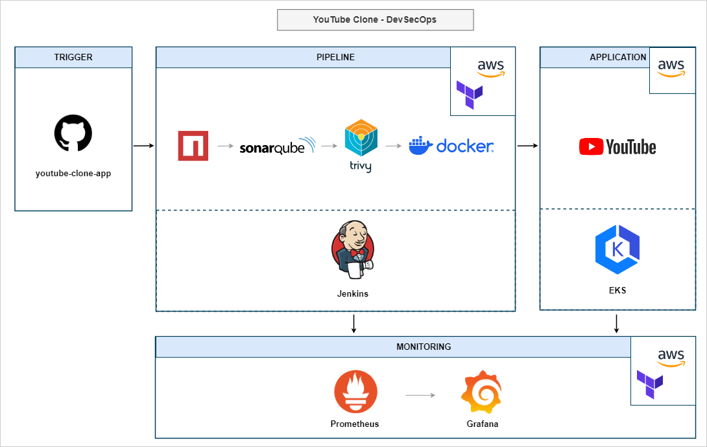

# YouTube Clone - DevSecOps

## Project Description

**Objective/Goal**:
- Implement a CI/CD pipeline for a YouTube clone application using Jenkins and Terraform, automating testing, building, and deployment processes to enhance productivity and reliability.

**Sector**:
- Software Development

**Technologies Used**:
- **Jenkins**: Automates the build and deployment processes.
- **Terraform**: Manages the infrastructure on AWS. Refer to the main.tf files in the [Jenkins-SonarQube-VM](./Jenkins-SonarQube-VM/main.tf) and [Monitoring-Server](./Monitoring-Server/main.tf) directories.
- **SonarQube**: Ensures code quality through continuous inspection.
- **Docker**: Used for the containerization of the application.
- **Prometheus and Grafana**: Monitors the application and infrastructure performance.
- **Kubernetes**: Orchestrates the deployment of the containerized application.

## Trigger & Pipeline

**Architecture Overview**:
- The system architecture involves a Jenkins server set up via Terraform that triggers pipelines on code commits, integrating SonarQube, Docker, and Kubernetes. See the architecture diagram here: 

**Trigger**:
- Commits to [GitHub - yash-analytics/youtube-clone-app](https://github.com/yash-analytics/youtube-clone-app) automatically trigger the Jenkins pipeline.

**Pipeline Steps**:
- Refer to the Jenkins pipeline stages in the screenshot: 

## Monitoring with Grafana

- **Overview**:
    - Grafana is used to monitor Jenkins and Kubernetes, providing real-time insights into the infrastructure's performance and health.
- **Dashboards**:
    - **Jenkins Monitoring**: Visualizes the performance and stability of the Jenkins environment. 
    - **Kubernetes Monitoring**: Tracks the Kubernetes cluster's resource usage and operational status. 

## Results

- Demonstrates the effectiveness of a fully automated CI/CD process in a real-world application deployment.
- Comparisons of the original vs. updated pages of the application are shown in the screenshots:
    - Original Page:

  

    - Updated Page:

  

## Learnings

- Proficiency in Jenkins for CI/CD pipelines.
- Enhanced skills in Docker and Kubernetes for containerization and deployment.
- In-depth understanding of infrastructure monitoring with Prometheus and Grafana.
- Improved code quality management with SonarQube.
- Effective management and provisioning of infrastructure using Terraform.
